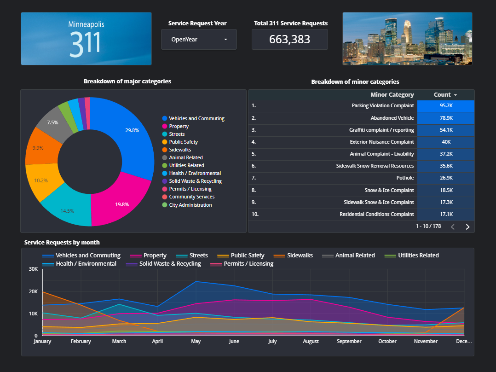

### Table of contents
- [Project Purpose](#project-purpose)
- [Technologies](#technologies)
- [Data Pipeline](#data-pipeline)
- [Reproducing this project](#reproducing-this-project)
- [Results](#results)
- [Future Development](#future-development)

## Project purpose

This repository is the final project of the [DataTalksClub Data Engineering Zoomcamp](https://github.com/DataTalksClub/data-engineering-zoomcamp).  I selected data from the city of Minneapolis's OpenData set, for their 311 Department, as the dataset to explore and build a project around.  I had a rough idea of what the 311 Department helped support, but not a full grasp of the all the different types of requests involved or the volume of them.

The 311 Department is the primary source of contact for the city of Minneapolis, for non-emergecy information and service requests.  Part of their responsibilities are to start service requests for other departments to resolve.

The final dashboard will help answer questions of:

1) What types of service requests does the city of Minneapolis support?
2) What is the breakdown of service requests categories?
3) What is the volume of requests throughout the year?  Does the volume vary among categories of requests?

## Technologies

This project utilizes the following technologies and tools:

* Google Cloud Platform 
    * Google Storage buckets as Data Lake
    * Google Bigquery datasets as Data Warehouse
    * Google Looker Studio reports for Data Visualization
    * Google Compute Engine, if you use a VM on Google's Cloud Platform
* Terraform as Infrastructure as Code, to deploy Buckets and Datasets on Google Cloud Platform
* Python script acts as the data pipeline, from initial retrieveal of the data staging it in BigQuery, and to running the dbt models
* Prefect as the orchestration tool
* dbt for some data quality testing, data modelling and transformation, and promotion of data to Production BigQuery dataset
* Parquet columnar data files
* Piperider during development to assist with reviewing dbt model changes

## Data Pipeline

The data pipeline will do the following:

1) Loop through each year passed to the pipeline.  

2) Query the Minneapolis 311 datasets via API.  There are separate data sets for each year, and can only return 1000 records per API request.  An initial request is made to pull the list of IDs in a year's dataset and then make additional requests for batches of 1000 records, until all records are retrieved.

3) The API returns results in a nested .json format.  As each batch of 1000 records are returned, the appropriate values from the .json file that have the data fields are placed in a Pandas DataFrame, and then appended into a consolidated DataFrame.

4) Once all the records are returned for a year, the DataFrame has data types applied to each field and field names are updated to more meaningful names.

5) The Pandas DataFrame is saved as a Parquet file locally, and then uploaded to the Google Storage Bucket acting as a data lake, that the Terraform process created

6) Once all the years of data are processed, then the data is staged from the Data Lake to the Staging BigQuery Dataset that the Terraform process created.  An external table is created, and then a materialized table.  The materialized table is partitioned on YEAR(open_datetime) and then clustered on subject_name and type_name.  

    With this data set being fairly small, I was thinking that not partitioning would be the way to go.  However, testing my dbt models with non-partitioned, partitioned, clustered, and finally partitioned and clustered showed that I was getting the fastest results when using tables that were both partitioned and clustered.  The process's performance was about 33% better than the other options

7) Once the data is staged in BigQuery, then the dbt models are run.  The dbt models involve the following:

  * A seed file that I manually prepared, that standardizes some of the values for the layers of categorization.  In the original data, there are categories that are similar, but slightly different based on the source of the service request.  For example, if you submit a service request through the Open311 app vs calling the 311 phone number, the categories are named slightly different but for a similar request.

  * The dbt models are run.  There's a staging model, and then some dimension models for dates, categories and geography information, there's a fact model, and then a reporting model with aggregated data that will support the dashbaord I create.

  * Some dbt tests that I prepared are run with the models.  They are all set with a severity of warn, which will just warn you of any tests that fail.  You should expect to see a few warnings about non-unique values in case_id, some warnings about the open_datetime being after closed_datetime, and now a warning about a new category showing up in the data.

## Reproducing this project

Reproducing this project has been tested on an Ubuntu 20.04 LTS VM, in both Google Cloud and a Proxmox homelab.  This project will require a similar VM, a Google Cloud account, a project on Google Cloud, and a service account with appropriate permissions for the project.

1) If you need to set up a VM, an account, project, or service account on Google Cloud, see [Setup Readme](https://github.com/mikecolemn/mpls-311-data/blob/main/setup/setup_readme.md) for more detailed instructions.

2) On your VM, clone the repo, `git clone https://github.com/mikecolemn/mpls-311-data.git`, and then `cd` into the repo folder

3) If you need to install the Google Cloud CLI, Anaconda, and Terraform, you can run bash script, `bash ./setup/setup.sh`, which will perform the following actions:

    * Apply initial updates, and install
    * Install Google Cloud cli application
    * Setup Anaconda and Terraform.

    * (Note) This may take a little time to process and if you see any prompts from updates, you can hit <OK> on any prompts and `f` for the MORE prompt for the Anaconda setup

4) Setup your conda virtual environment with the following commands:

    * `source ~/.bashrc` - (if you just installed Anaconda above, and haven't restarted your shell session)
    * `conda create -n mpls311 python=3.9 -y`
    * `conda activate mpls311`
    * `pip install -r ./setup/conda_requirements.txt`

5) Save your Google Cloud service account .json file to the ./creds folder.  You can sftp the file from your local computer to that location.  You could even just open the file on your local computer, copy the contents of the file and do `nano ./creds/[filename].json` on the VM and paste in the contents into this new blank file, and then do CTRL + X, and then `Y` and ENTER, to save and exit the file.

6) Set an environment variable for your service account file that you just saved with this command: `export GOOGLE_APPLICATION_CREDENTIALS="<absolute path to the json file in the ./creds folder>"`

7) Update the GOOGLE_APPLICATION_CREDENTIALS environment variable in the ./.env file, using the same absolute path to the .json service account file

8) Run `gcloud auth activate-service-account --key-file $GOOGLE_APPLICATION_CREDENTIALS` to authenticate with Google Cloud, with your service account .json file.

9) Run terraform to deploy your infrastructure to your Google Cloud Project.  Run the following commands:

    * `terraform -chdir="./terraform" init` - to initialize terraform
    * `terraform -chdir="./terraform" plan -var="project=<project id here>"`, replacing <project id here> with your Google Project ID.  This will build a deployment plan that you can review.
    * `terraform -chdir="./terraform" apply -var="project=<project id here>"`, replacing <project id here> with your Google Project ID.  This will apply the deployment plan and deploy the infrastructure

10) Run the following commands to set up a local prefect profile

    * `prefect profile create mpls311`
    * `prefect profile use mpls311`
    * `prefect config set PREFECT_API_URL=http://127.0.0.1:4200/api`

11) Open two new terminal windows and ssh into your VM.  These additional terminals are going to be for launching the prefect orion server, and to launch a work queue, which will process deployed pipelines

    * Additional window 1:
        * `conda activate mpls311`
        * `prefect orion start`

    * Additional window 2:
        * `conda activate mpls311`
        * `prefect agent start --work-queue "default"`

12) From your original terminal session, Run this command to setup some blocks for your GCP credentials in prefect: `python ./setup/prefect_setup_blocks.py`

13) From your original terminal session, run the following three commands to deploy the pipeline to prefect and then run it for all years of data

    * `prefect deployment build flows/mpls_311.py:parent_process_data -n "Mpls-311-ETL"`
    * `prefect deployment apply parent_process_data-deployment.yaml`
    * `prefect deployment run Process-Data-Parent/Mpls-311-ETL -p "years=[2015,2016,2017,2018,2019,2020,2021,2022,2023]"`

    This may take 5-10 minutes to run the full pipeline.  You can switch to the terminal session for the work queue to watch the progress if you like.

14) > **Important note: Once you're done evaluating this project, make sure to stop and remove any cloud resources.  If you're using a cloud VM, make sure to stop it in your VM Instances screen in Google Cloud Console, and potentially delete it if you no longer want it.  This way it's not up and running, and using up your credits.  In addition, you can use Terraform to destroy your buckets and datasets, with `terraform -chdir="./terraform" destroy -var="project=<project id here>"`**

## Results

Below is an example dashboard I've put together based on this data.

The link below is available for anyone to try out.  You can filter the report based on certain years.  You can drill down into major categories and the graphs will adjust based on that.

https://lookerstudio.google.com/s/iIP-OfIawPI

As I look through the reports, there are a number of things that jump a lot that jumps out at me:

1) There are a small number of major categories of service requests, 13 of them.  Below those categories though, there are 177 different minor categories of requests they coordinate.

1) Over the years, the major category with the most service requests is Vehicles and Commuting.  That category also has the top two minor categories for Parking Violations and Abandoned Vehicles.  I'm surprised there are so many requests related to abandoned vehicles.

2) Some variations in certain categories throughout the year make sense.  For example, service requests related to Sidewalk Snow or Ice issues or Street Snow and Ice issues are typically November through April, given the winter here.  Similarly, service requests for exterior nuisance complaints are highest from May thorugh September, when people here are outside more and no longer hibernating.  There's also a very noticable spike related to Pothole and Sewer Issue service requests in March specifically, likely related to Winter ending.

## Future development

I currently plan on continuing to refine this project and pipeline, expanding out my knowledge and experience.  Some things that immediately come to mind that I think are worth exploring:

1) Dockerizing the Prefect Orion server, so the server and worker queue can just run in the background as a docker container

2) Refining my API functionality, such as implementing functionality to check the json response for information, error handling and checking for the parameter indicating the return record count limits

3) Implementing some tracking table(s), tracking each run of the pipeline, tracking information such as date run, record counts, parameters used, etc.

4) Alter the process to allow for a full data process, and also incremental updates.  This would likely include changes to the dbt models, changes to the API functionality, and utilizing the tracking table(s) referenced above

5) There's a lot more analysis that can be performed on this data set.  One interesting idea that comes to mind is looking at the time it takes for service requests to be completed, defining KPIs or SLAs based on prior year's data as benchmarks, and evaulating the next year's data against those benchmarks.  It would also be interesting to explore how to utilize the geography coordinates in the data, to evaluate the data against neighborhoods or locations in the city.

6) Building additional functionality allowing the process to be run on a variety of systems.  For example, building functionality for local storage and local postgres or duckdb database instances, or utilizing other cloud services, such as with AWS.

7) Implementing Continuous Integration / Continuous Deployment (CI/CD)